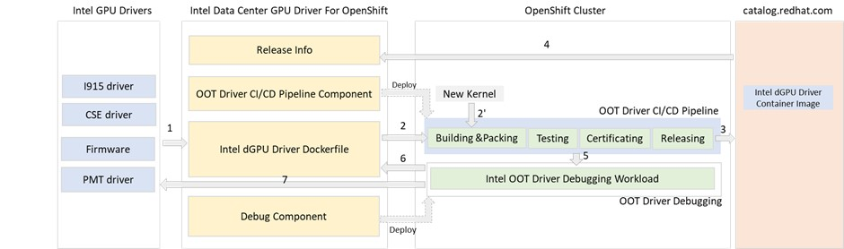

# Disclaimer 
This project is currently under active development, and as such, all source code may not be included in any release. This means that the code is subject to change without notice, and that any information contained within the code should be considered as work in progress. 

# INTEL® Data Center GPU Driver for OpenShift* 

## General

figure 1. Intel Data Center GPU Driver Container Image Releasing Flow

**Intel Data Center GPU Driver for OpenShift project** is used to build, package, and release Intel data center GPU driver images for [Red Hat OpenShift Container Platform (OCP)](https://www.redhat.com/en/technologies/cloud-computing/openshift/container-platform). Users can make use of the [pre-built & released images](release/README.md) to provision Intel Data Center GPU Cards on OCP. They also can use Intel dGPU Driver Dockerfile released from this project as a reference to on-premises build the driver container images and provision the cards. In this 0.1.0 release [Intel Flex Serial GPU cards](https://www.intel.com/content/www/us/en/products/docs/discrete-gpus/data-center-gpu/flex-series/overview.html) are supported. [Intel Max Serial GPU card support](https://www.intel.com/content/www/us/en/products/details/discrete-gpus/data-center-gpu/max-series.html) is in the plan.

Intel dGPU driver container image is built from [Intel GPU Drivers](https://github.com/intel-gpu) which includes

*	**[Intel GPU i915 driver for RHEL](https://github.com/intel-gpu/intel-gpu-i915-backports)**
* **[Intel® Converged Security Engine(CSE) driver for RHEL](https://github.com/intel-gpu/intel-gpu-cse-backports)**
*	**[Intel® Platform Monitoring Technology(PMT) driver for RHEL](https://github.com/intel-gpu/intel-gpu-pmt-backports/)**
*	**[Intel® GPU firmware](https://github.com/intel-gpu/intel-gpu-firmware)** 

To build Intel Data Center GPU driver images and provision the GPU cards on OCP, two scenarios have to be supported. Figure 1. Intel Data Center GPU Driver Container Image Releasing Flow can be used to demonstrate the releasing flow to support the two scenarios

**Driver Upgrading Scenario** - Intel GPU Drivers have new release or the new feature (bug fixing) wants to be verified.
*	Step 1: the Intel dGPU Driver Dockerfile cloned from this project is updated to include the new release tag or branches include the new feature (bug fixing)
*	Step 2: The change of above Dockerfile will trigger the Out-Of-Tree (OOT) Driver CI/CD pipeline running on user OpenShift Cluster. The CI/CD pipeline works on building, packing, testing, certificating, and releasing the images. OOT driver CI/CD components maintained in the project can be used to deploy the CI/CD pipeline on the cluster. This pipeline also reports any issue detected in the above process. If something wrong is detected, it will go to Step 5.
*	Step 3: Release the driver container image on [Red Hat Ecosytem Catalog](https://catalog.redhat.com/)
*	Step 4: Update the Intel Data Center GPU Driver Container Images Release Table. If needed, cut a new release for the project
*	Step 5: if any problem is detected by the CI/CD pipeline, Intel OOT Driver Debugging Workload can be used to debug the problem. This debug component can be used to deploy the debugging workload.
*	Step 6: if it is Intel dGPU driver Dockerfile issue, update file to fix the issue. It will trigger Step 2.
*	Step 7: if it is the Intel GPU Drivers issue, submit the issue in the corresponding driver repo and fix the issue with the driver owner. After the problem get fixed, it will trigger step1     

**Kernel Upgrading Scenario** - When OCP RHCOS/RHEL kernel is upgraded, the new driver container image needs to be rebuilt to match the new kernel. 

Most of the steps for this Scenario is same with driver upgrading scenario. The only difference is that this scenario starts from step 2’ when the OCP cluster is upgraded or the new OCP cluster is provisioned, a new RHCOS/RHEL kernel version is detected. That will trigger the CI/CD pipeline.

## [Intel dGPU Driver Dockerfile Introduction](docker/README.md)

## [Debug Intel dGPU Driver on OpenShift Cluster](debug/README.md)

## [Deploy OOT driver CI/CD Pipeline On OpenShift Cluster](pipeline/README.md)

## Working With Kernel Module Manager (KMM) Operator on OpenShift
This project releases Intel dGPU Driver Container Images for OCP on Red Hat ecosystem catalog regularly to support different version of OCP release. With KMM operator which is shipped from OCP-4.12, users can leverage KMM operator [pre-build mode](https://github.com/intel/intel-technology-enabling-for-openshift/tree/main/kmmo#kmm-operator-working-mode) to deploy and manage Intel dGPU OOT driver on the OpenShift Cluster. It is the [default usage mode](https://github.com/intel/intel-technology-enabling-for-openshift/tree/main/kmmo#kmm-operator-working-mode) suggested from [Intel Technology Enabling Project](https://github.com/intel/intel-technology-enabling-for-openshift).

If users want to build the tailored intel dGPU driver container image, KMM operator [on-premises build mode](https://github.com/intel/intel-technology-enabling-for-openshift/tree/main/kmmo#using-on-premise-build-mode) can be used to build the image on their own OpenShift clusters environment and then deploy and manage the OOT driver on the clusters.
